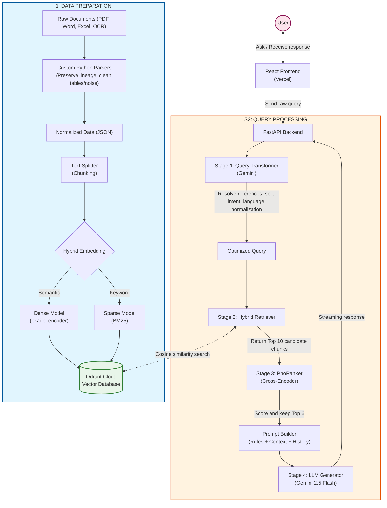

```mermaid
graph TD
    %% Styling
    classDef offline fill:#e1f5fe,stroke:#01579b,stroke-width:2px;
    classDef online fill:#fff3e0,stroke:#e65100,stroke-width:2px;
    classDef database fill:#e8f5e9,stroke:#2e7d32,stroke-width:2px;
    classDef user fill:#fce4ec,stroke:#880e4f,stroke-width:2px;

    %% -----------------------------------------
    %% STAGE 1: OFFLINE DATA PIPELINE
    %% -----------------------------------------
    subgraph Offline_Pipeline ["1: DATA PREPARATION"]
        direction TB
        RawData["Raw Documents (PDF, Word, Excel, OCR)"] --> CustomParser["Custom Python Parsers<br>(Preserve lineage, clean tables/noise)"]
        CustomParser --> JSON["Normalized Data (JSON)"]
        JSON --> Splitter["Text Splitter<br>(Chunking)"]
        Splitter --> Embedder{"Hybrid Embedding"}
        
        Embedder -->|Semantic| Dense["Dense Model<br>(bkai-bi-encoder)"]
        Embedder -->|Keyword| Sparse["Sparse Model<br>(BM25)"]
        
        Dense --> QdrantDB
        Sparse --> QdrantDB
    end

    %% -----------------------------------------
    %% DATABASE
    %% -----------------------------------------
    QdrantDB[("Qdrant Cloud<br>Vector Database")]:::database

    %% -----------------------------------------
    %% STAGE 2: ONLINE RAG PIPELINE
    %% -----------------------------------------
    subgraph Online_Pipeline ["S2: QUERY PROCESSING"]
        direction TB
        
        FastAPI["FastAPI Backend"] --> Q_Transform["Stage 1: Query Transformer<br>(Gemini)"]
        
        Q_Transform -->|Resolve references, split intent, language normalization| CleanQuery["Optimized Query"]
        
        CleanQuery --> Retriever["Stage 2: Hybrid Retriever"]
        Retriever <-.->|Cosine similarity search| QdrantDB
        
        Retriever -->|Return Top 10 candidate chunks| Reranker["Stage 3: PhoRanker<br>(Cross-Encoder)"]
        
        Reranker -->|Score and keep Top 6| PromptBuilder["Prompt Builder<br>(Rules + Context + History)"]
        PromptBuilder --> Generator["Stage 4: LLM Generator<br>(Gemini 2.5 Flash)"]
    end

    %% -----------------------------------------
    %% FRONTEND & USER INTERACTION
    %% -----------------------------------------
    User(("User")):::user <-->|Ask / Receive response| VercelUI["React Frontend<br>(Vercel)"]
    VercelUI -->|Send raw query| FastAPI
    Generator -->|Streaming response| FastAPI

    %% Apply classes
    class Offline_Pipeline offline;
    class Online_Pipeline online;
```
